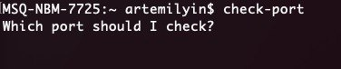
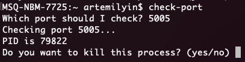
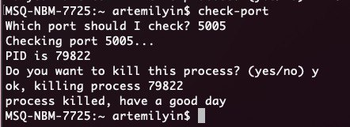

# check-port
Have you ever wanted to run some program on a certain port, but seen a message saying this port is in use? And then googling or maybe typing long commands, blah blah blah... This script's here to help you with it. 

## Installation
- clone repository to some location on your computer or download an archive and unpack it.
- make file executable by running `chmod 777 /path/to/where/you/put/check-port`
- create a symlink that would be placed somewhere (for example /url/local/bin) by `ln /path/to/where/you/put/check-port /urs/local/bin/check-port`
- run check-port on your computer from everywhere.

## How it works?
When you type `check-port` on your terminal it asks you 'Which port should I check?' and asks for your input to a port. Alternatively you can provide 'p' option with number of a port. Just like this `check-port -p 3000`. If nothing provided the program will continue to ask for the port number. Then it checks if the port provided is numeric value or not. The programm will bother user until one provides numeric value or force quits programm execution. Then the programm checks if the port is in use or not. If it's in use the programm will ask you if it should kill the process. In case if you press Y or y process would be killed and you can do whatever you want with the port. Here are some illustrations to help you out.

Illustrations are bit out of date, but you've got the concept.
1. 
2. 
3. 

## Credits
I did it, because I was tired to run `lsof -i tcp:_port_number_ | grep LISTEN`, and then copying process id and then running `kill -9 _process_id_`. So I made this script with some checks and askings that may help you out. For any information or if you have any question reach out me via email info@itilin.by or [telegram](https://t.me/itilin). Check my personal site [itilin.by](http://itilin.by) I have some articles in [blog](http://itilin.by/blog) section.

It ain't much but the honest work

## TODO:
- add default value for killing question. Probably Y, because during usage I mostly answer yes...